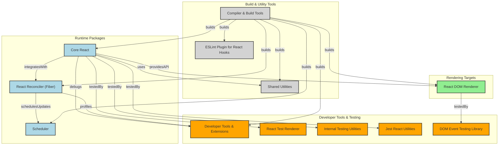

# React

```mermaid
flowchart TD
    %% Runtime Packages
    subgraph "Runtime Packages"
        coreReact["Core React"]:::runtime
        reconciler["React Reconciler (Fiber)"]:::runtime
        scheduler["Scheduler"]:::runtime
    end

    %% Rendering Targets
    subgraph "Rendering Targets"
        reactDom["React DOM Renderer"]:::rendering
    end

    %% Developer Tools & Testing
    subgraph "Developer Tools & Testing"
        devtools["Developer Tools & Extensions"]:::devtools
        testRenderer["React Test Renderer"]:::devtools
        internalTest["Internal Testing Utilities"]:::devtools
        jestReact["Jest React Utilities"]:::devtools
        domEventLib["DOM Event Testing Library"]:::devtools
    end

    %% Build & Utility Tools
    subgraph "Build & Utility Tools"
        compiler["Compiler & Build Tools"]:::build
        eslintPlugin["ESLint Plugin for React Hooks"]:::build
        sharedUtilities["Shared Utilities"]:::build
    end

    %% Connections between components
    coreReact -->|"providesAPI"| reactDom
    coreReact -->|"integratesWith"| reconciler
    reconciler -->|"schedulesUpdates"| scheduler
    coreReact -->|"uses"| sharedUtilities

    coreReact -->|"debugs"| devtools
    reconciler -->|"profiles"| devtools

    compiler -->|"builds"| coreReact
    compiler -->|"builds"| reconciler
    compiler -->|"builds"| reactDom
    compiler -->|"builds"| scheduler
    compiler -->|"builds"| devtools
    compiler -->|"builds"| eslintPlugin
    compiler -->|"builds"| sharedUtilities

    coreReact -->|"testedBy"| testRenderer
    coreReact -->|"testedBy"| internalTest
    coreReact -->|"testedBy"| jestReact
    reactDom -->|"testedBy"| domEventLib

    %% Styles
    classDef runtime fill:#ADD8E6,stroke:#333,stroke-width:2px;
    classDef rendering fill:#90EE90,stroke:#333,stroke-width:2px;
    classDef devtools fill:#FFA500,stroke:#333,stroke-width:2px;
    classDef build fill:#D3D3D3,stroke:#333,stroke-width:2px;

    %% Click Events
    click coreReact "https://github.com/facebook/react/tree/main/packages/react/"
    click reactDom "https://github.com/facebook/react/tree/main/packages/react-dom/"
    click reconciler "https://github.com/facebook/react/tree/main/packages/react-reconciler/"
    click scheduler "https://github.com/facebook/react/tree/main/packages/scheduler/"
    click testRenderer "https://github.com/facebook/react/tree/main/packages/react-test-renderer/"
    click devtools "https://github.com/facebook/react/tree/main/packages/react-devtools-core/"
    click eslintPlugin "https://github.com/facebook/react/tree/main/packages/eslint-plugin-react-hooks/"
    click internalTest "https://github.com/facebook/react/tree/main/packages/internal-test-utils/"
    click jestReact "https://github.com/facebook/react/tree/main/packages/jest-react/"
    click compiler "https://github.com/facebook/react/tree/main/compiler/"
    click sharedUtilities "https://github.com/facebook/react/tree/main/packages/shared/"
    click domEventLib "https://github.com/facebook/react/tree/main/packages/dom-event-testing-library/"

    %% Additional click for Developer Tools Extensions (optional)
    click devtools "https://github.com/facebook/react/tree/main/packages/react-devtools-extensions/"
```