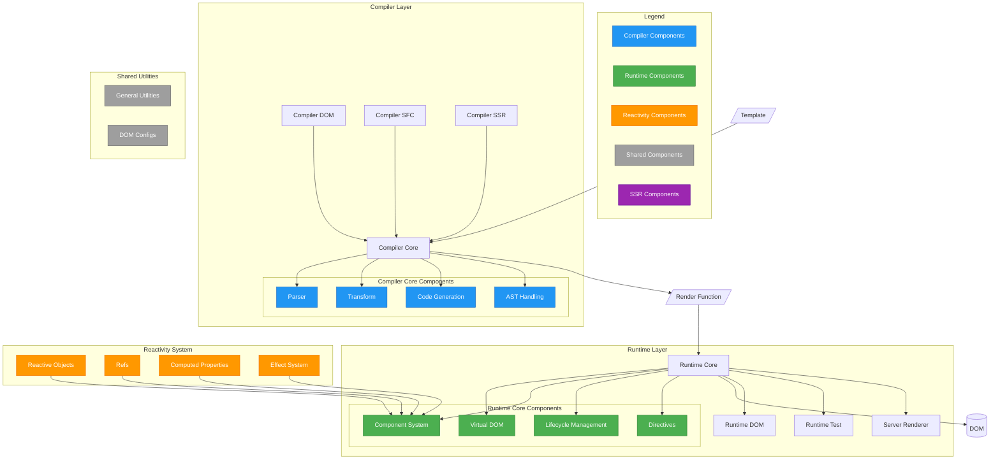
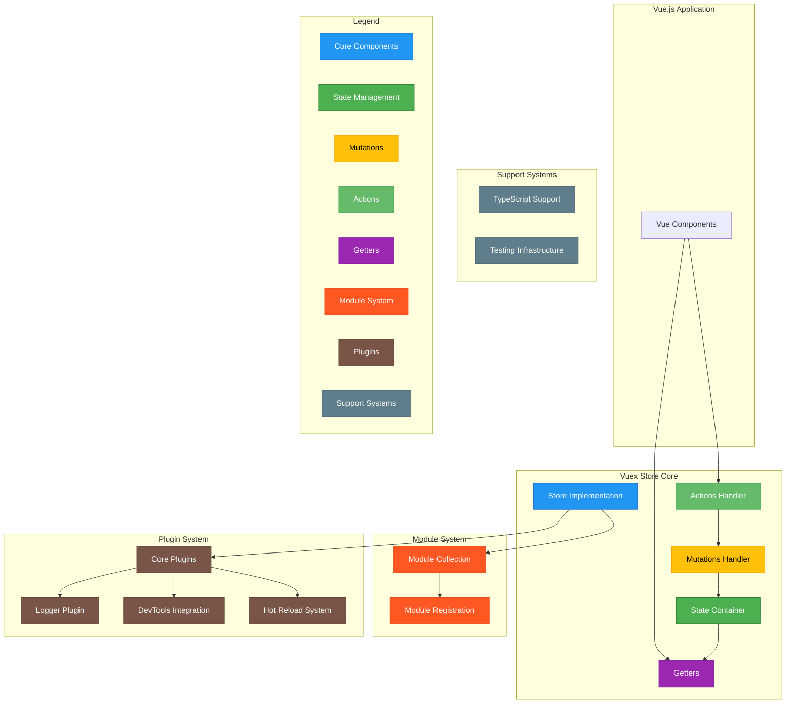
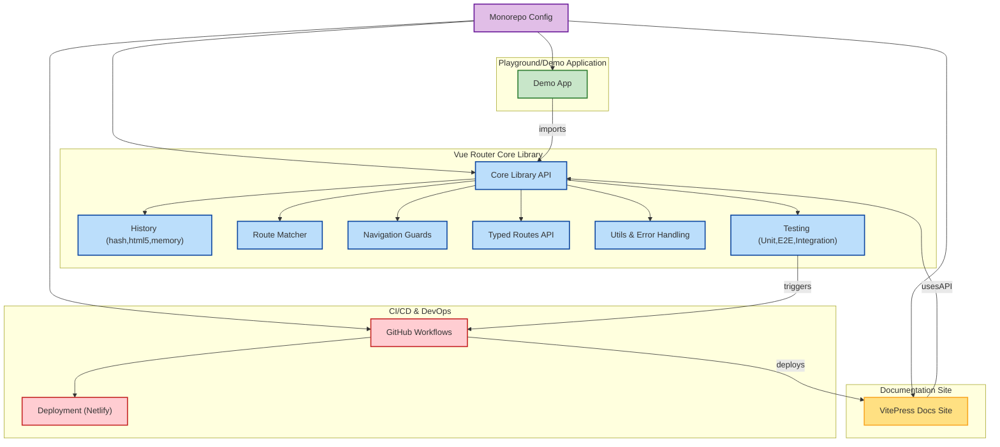
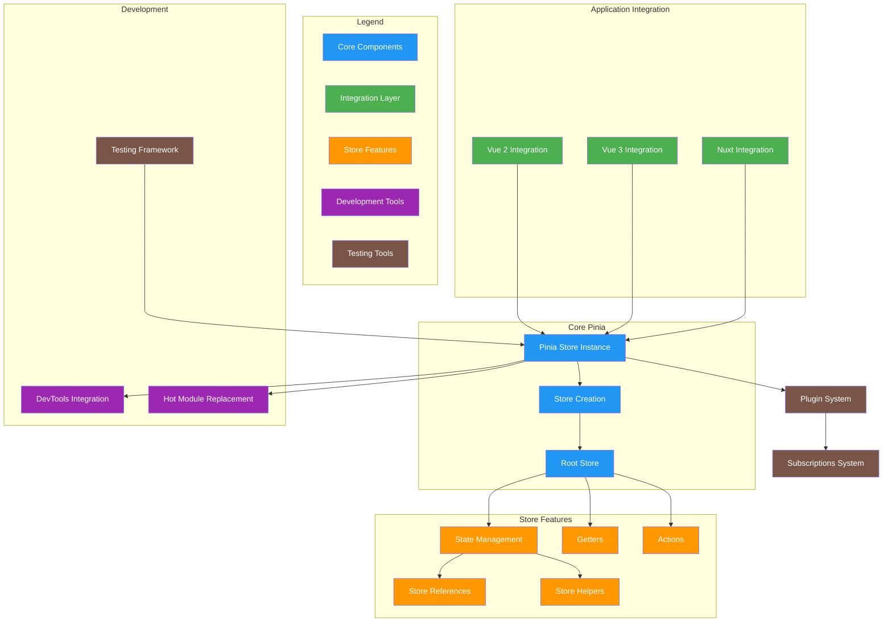
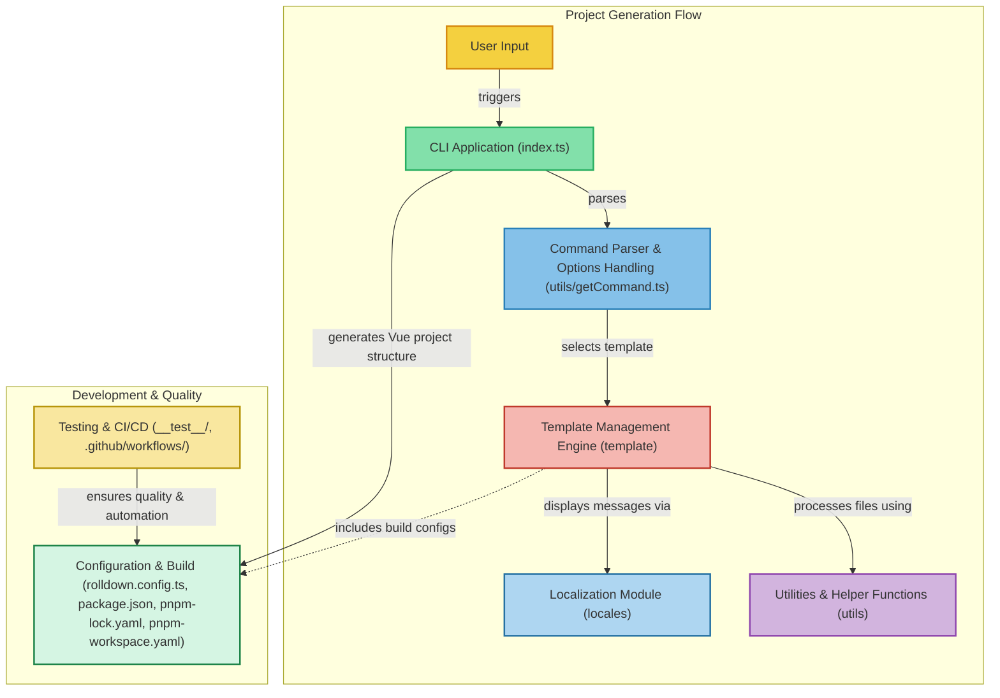
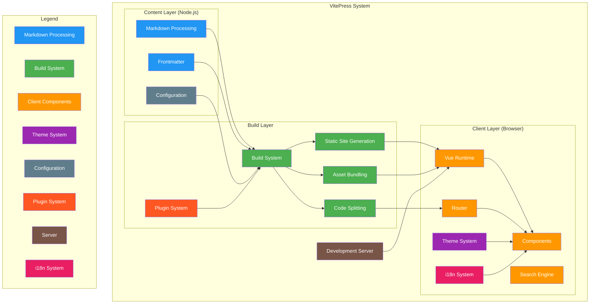

# 记一些关于Vue的笔记

## Vue流程图

```mermaid
graph TB
    subgraph Legend
        L1[Compiler Components]:::compiler
        L2[Runtime Components]:::runtime
        L3[Reactivity Components]:::reactivity
        L4[Shared Components]:::shared
        L5[SSR Components]:::ssr
    end

    subgraph "Compiler Layer"
        CC["Compiler Core"]
        CD["Compiler DOM"]
        CSFC["Compiler SFC"]
        CSSR["Compiler SSR"]

        subgraph "Compiler Core Components"
            Parser["Parser"]:::compiler
            Transform["Transform"]:::compiler
            CodeGen["Code Generation"]:::compiler
            AST["AST Handling"]:::compiler
        end

        CC --> Parser
        CC --> Transform
        CC --> CodeGen
        CC --> AST
    end

    subgraph "Runtime Layer"
        RC["Runtime Core"]
        RD["Runtime DOM"]
        RT["Runtime Test"]
        SR["Server Renderer"]

        subgraph "Runtime Core Components"
            VDOM["Virtual DOM"]:::runtime
            CompSys["Component System"]:::runtime
            LifeCycle["Lifecycle Management"]:::runtime
            Directives["Directives"]:::runtime
        end

        RC --> VDOM
        RC --> CompSys
        RC --> LifeCycle
        RC --> Directives
    end

    subgraph "Reactivity System"
        ReactiveObj["Reactive Objects"]:::reactivity
        Refs["Refs"]:::reactivity
        Computed["Computed Properties"]:::reactivity
        Effects["Effect System"]:::reactivity
    end

    subgraph "Shared Utilities"
        Utils["General Utilities"]:::shared
        DOMConfig["DOM Configs"]:::shared
    end

    Template[/"Template"/] --> CC
    CC --> RenderFunc[/"Render Function"/]
    RenderFunc --> RC
    RC --> DOM[("DOM")]

    CD --> CC
    CSFC --> CC
    CSSR --> CC

    RC --> RD
    RC --> RT
    RC --> SR

    ReactiveObj --> CompSys
    Refs --> CompSys
    Computed --> CompSys
    Effects --> CompSys

    %% Click events for component mapping
    click CC "https://github.com/vuejs/core/tree/main/packages/compiler-core"
    click Parser "https://github.com/vuejs/core/blob/main/packages/compiler-core/src/parser.ts"
    click Transform "https://github.com/vuejs/core/blob/main/packages/compiler-core/src/transform.ts"
    click CodeGen "https://github.com/vuejs/core/blob/main/packages/compiler-core/src/codegen.ts"
    click CD "https://github.com/vuejs/core/tree/main/packages/compiler-dom"
    click CSFC "https://github.com/vuejs/core/tree/main/packages/compiler-sfc"
    click CSSR "https://github.com/vuejs/core/tree/main/packages/compiler-ssr"
    click RC "https://github.com/vuejs/core/tree/main/packages/runtime-core"
    click VDOM "https://github.com/vuejs/core/blob/main/packages/runtime-core/src/vnode.ts"
    click CompSys "https://github.com/vuejs/core/blob/main/packages/runtime-core/src/component.ts"
    click RD "https://github.com/vuejs/core/tree/main/packages/runtime-dom"
    click SR "https://github.com/vuejs/core/tree/main/packages/server-renderer"
    click ReactiveObj "https://github.com/vuejs/core/blob/main/packages/reactivity/src/reactive.ts"
    click Effects "https://github.com/vuejs/core/blob/main/packages/reactivity/src/effect.ts"
    click Computed "https://github.com/vuejs/core/blob/main/packages/reactivity/src/computed.ts"
    click Refs "https://github.com/vuejs/core/blob/main/packages/reactivity/src/ref.ts"
    click Utils "https://github.com/vuejs/core/blob/main/packages/shared/src/general.ts"
    click DOMConfig "https://github.com/vuejs/core/blob/main/packages/shared/src/domTagConfig.ts"

    classDef compiler fill:#2196F3,stroke:#1565C0,color:white
    classDef runtime fill:#4CAF50,stroke:#2E7D32,color:white
    classDef reactivity fill:#FF9800,stroke:#EF6C00,color:white
    classDef shared fill:#9E9E9E,stroke:#616161,color:white
    classDef ssr fill:#9C27B0,stroke:#6A1B9A,color:white
```
---
## Vuex流程图

```mermaid
graph TB
    %% Main Layers
    subgraph VueApp["Vue.js Application"]
        Components["Vue Components"]
    end

    subgraph StoreCore["Vuex Store Core"]
        Store["Store Implementation"]:::core
        State["State Container"]:::state
        Mutations["Mutations Handler"]:::mutation
        Actions["Actions Handler"]:::action
        Getters["Getters"]:::getter
    end

    subgraph ModuleSystem["Module System"]
        ModuleCollection["Module Collection"]:::module
        ModuleRegistration["Module Registration"]:::module
    end

    subgraph PluginSystem["Plugin System"]
        Plugins["Core Plugins"]:::plugin
        Logger["Logger Plugin"]:::plugin
        DevTools["DevTools Integration"]:::plugin
        HotReload["Hot Reload System"]:::plugin
    end

    subgraph Support["Support Systems"]
        TypeSystem["TypeScript Support"]:::support
        Testing["Testing Infrastructure"]:::support
    end

    %% Relationships
    Components --> Getters
    Components --> Actions
    Actions --> Mutations
    Mutations --> State
    State --> Getters
    Store --> ModuleCollection
    ModuleCollection --> ModuleRegistration
    Store --> Plugins
    Plugins --> Logger
    Plugins --> DevTools
    Plugins --> HotReload

    %% Click Events
    click Store "https://github.com/vuejs/vuex/blob/main/src/store.js"
    click State "https://github.com/vuejs/vuex/blob/main/docs/guide/state.md"
    click Mutations "https://github.com/vuejs/vuex/blob/main/docs/guide/mutations.md"
    click Actions "https://github.com/vuejs/vuex/blob/main/docs/guide/actions.md"
    click Getters "https://github.com/vuejs/vuex/blob/main/docs/guide/getters.md"
    click ModuleCollection "https://github.com/vuejs/vuex/blob/main/src/module/module-collection.js"
    click ModuleRegistration "https://github.com/vuejs/vuex/blob/main/src/module/module.js"
    click Plugins "https://github.com/vuejs/vuex/tree/main/src/plugins"
    click Logger "https://github.com/vuejs/vuex/blob/main/src/plugins/logger.js"
    click DevTools "https://github.com/vuejs/vuex/blob/main/src/plugins/devtool.js"
    click HotReload "https://github.com/vuejs/vuex/blob/main/test/unit/hot-reload.spec.js"
    click TypeSystem "https://github.com/vuejs/vuex/blob/main/types/index.d.ts"
    click Testing "https://github.com/vuejs/vuex/tree/main/test/unit"

    %% Styling
    classDef core fill:#2196F3,stroke:#1565C0,color:white
    classDef state fill:#4CAF50,stroke:#2E7D32,color:white
    classDef mutation fill:#FFC107,stroke:#FFA000,color:black
    classDef action fill:#66BB6A,stroke:#43A047,color:white
    classDef getter fill:#9C27B0,stroke:#7B1FA2,color:white
    classDef module fill:#FF5722,stroke:#E64A19,color:white
    classDef plugin fill:#795548,stroke:#5D4037,color:white
    classDef support fill:#607D8B,stroke:#455A64,color:white

    %% Legend
    subgraph Legend
        CoreL["Core Components"]:::core
        StateL["State Management"]:::state
        MutationL["Mutations"]:::mutation
        ActionL["Actions"]:::action
        GetterL["Getters"]:::getter
        ModuleL["Module System"]:::module
        PluginL["Plugins"]:::plugin
        SupportL["Support Systems"]:::support
    end
```

---
## Vue Router

```mermaid
flowchart TD
    Config["Monorepo Config"]:::config

    subgraph "Vue Router Core Library"
        Core["Core Library API"]:::core
        R1["History (hash,html5,memory)"]:::core
        R2["Route Matcher"]:::core
        R3["Navigation Guards"]:::core
        R4["Typed Routes API"]:::core
        R5["Utils & Error Handling"]:::core
        R6["Testing (Unit,E2E,Integration)"]:::core
        Core --> R1
        Core --> R2
        Core --> R3
        Core --> R4
        Core --> R5
        Core --> R6
    end

    subgraph "Playground/Demo Application"
        Playground["Demo App"]:::playground
    end

    subgraph "Documentation Site"
        Docs["VitePress Docs Site"]:::docs
    end

    subgraph "CI/CD & DevOps"
        CICD["GitHub Workflows"]:::cicd
        Deploy["Deployment (Netlify)"]:::cicd
        CICD --> Deploy
    end

    Config --> Core
    Config --> Playground
    Config --> Docs
    Config --> CICD

    Playground -->|"imports"| Core
    Docs -->|"usesAPI"| Core
    R6 -->|"triggers"| CICD
    CICD -->|"deploys"| Docs

    click Core "https://github.com/vuejs/router/tree/main/packages/router"
    click Playground "https://github.com/vuejs/router/tree/main/packages/playground"
    click Docs "https://github.com/vuejs/router/tree/main/packages/docs"
    click CICD "https://github.com/vuejs/router/blob/main/.github"

    classDef core fill:#BBDEFB,stroke:#0D47A1,stroke-width:2px;
    classDef playground fill:#C8E6C9,stroke:#2E7D32,stroke-width:2px;
    classDef docs fill:#FFE082,stroke:#F9A825,stroke-width:2px;
    classDef cicd fill:#FFCDD2,stroke:#C62828,stroke-width:2px;
    classDef config fill:#E1BEE7,stroke:#6A1B9A,stroke-width:2px;
```
---

## Pinia

```mermaid
flowchart TB
    %% Styles
    classDef core fill:#2196F3,color:white
    classDef integration fill:#4CAF50,color:white
    classDef store fill:#FF9800,color:white
    classDef dev fill:#9C27B0,color:white
    classDef testing fill:#795548,color:white

    %% Legend
    subgraph Legend
        L1[Core Components]:::core
        L2[Integration Layer]:::integration
        L3[Store Features]:::store
        L4[Development Tools]:::dev
        L5[Testing Tools]:::testing
    end

    %% Main Application Layer
    subgraph "Application Integration"
        Vue2[Vue 2 Integration]
        Vue3[Vue 3 Integration]
        NuxtInt[Nuxt Integration]
    end

    %% Core Layer
    subgraph "Core Pinia"
        PiniaInstance[Pinia Store Instance]
        StoreCreation[Store Creation]
        RootStore[Root Store]
    end

    %% Store Features Layer
    subgraph "Store Features"
        State[State Management]
        Getters[Getters]
        Actions[Actions]
        StoreRefs[Store References]
        MapHelpers[Store Helpers]
    end

    %% Development Tools
    subgraph "Development"
        DevTools[DevTools Integration]
        HMR[Hot Module Replacement]
        Testing[Testing Framework]
    end

    %% Plugin System
    PluginSystem[Plugin System]
    Subscriptions[Subscriptions System]

    %% Relationships
    Vue2 --> PiniaInstance
    Vue3 --> PiniaInstance
    NuxtInt --> PiniaInstance
    PiniaInstance --> StoreCreation
    StoreCreation --> RootStore
    RootStore --> State
    RootStore --> Getters
    RootStore --> Actions
    PiniaInstance --> DevTools
    PiniaInstance --> HMR
    PiniaInstance --> PluginSystem
    PluginSystem --> Subscriptions
    State --> StoreRefs
    State --> MapHelpers
    Testing --> PiniaInstance

    %% Click Events
    click Vue2 "https://github.com/vuejs/pinia/blob/v2/packages/pinia/src/vue2-plugin.ts"
    click Vue3 "https://github.com/vuejs/pinia/blob/v2/packages/pinia/src/index.ts"
    click NuxtInt "https://github.com/vuejs/pinia/tree/v2/packages/nuxt/src/"
    click PiniaInstance "https://github.com/vuejs/pinia/blob/v2/packages/pinia/src/store.ts"
    click StoreCreation "https://github.com/vuejs/pinia/blob/v2/packages/pinia/src/createPinia.ts"
    click DevTools "https://github.com/vuejs/pinia/tree/v2/packages/pinia/src/devtools/"
    click Subscriptions "https://github.com/vuejs/pinia/blob/v2/packages/pinia/src/subscriptions.ts"
    click PluginSystem "https://github.com/vuejs/pinia/blob/v2/packages/pinia/src/types.ts"
    click Testing "https://github.com/vuejs/pinia/blob/v2/packages/testing/src/testing.ts"
    click HMR "https://github.com/vuejs/pinia/blob/v2/packages/pinia/src/hmr.ts"
    click MapHelpers "https://github.com/vuejs/pinia/blob/v2/packages/pinia/src/mapHelpers.ts"
    click RootStore "https://github.com/vuejs/pinia/blob/v2/packages/pinia/src/rootStore.ts"
    click StoreRefs "https://github.com/vuejs/pinia/blob/v2/packages/pinia/src/storeToRefs.ts"

    %% Style Applications
    class PiniaInstance,StoreCreation,RootStore core
    class Vue2,Vue3,NuxtInt integration
    class State,Getters,Actions,StoreRefs,MapHelpers store
    class DevTools,HMR dev
    class Testing,PluginSystem,Subscriptions testing
```
## create-vue

```mermaid
flowchart TD
    %% Core Generation Flow
    subgraph "Project Generation Flow"
        direction TB
        U["User Input"]:::user
        CLI["CLI Application (index.ts)"]:::cli
        CP["Command Parser & Options Handling (utils/getCommand.ts)"]:::parser
        TM["Template Management Engine (template)"]:::template
        UT["Utilities & Helper Functions (utils)"]:::utility
        LM["Localization Module (locales)"]:::localization

        U -->|"triggers"| CLI
        CLI -->|"parses"| CP
        CP -->|"selects template"| TM
        TM -->|"processes files using"| UT
        TM -->|"displays messages via"| LM
    end

    %% Development & Quality Flow
    subgraph "Development & Quality"
        direction TB
        TCI["Testing & CI/CD (__test__/, .github/workflows/)"]:::ci
        CB["Configuration & Build (rolldown.config.ts, package.json, pnpm-lock.yaml, pnpm-workspace.yaml)"]:::config

        TCI -->|"ensures quality & automation"| CB
    end

    %% Connections between Generation and Development
    CLI -->|"generates Vue project structure"| CB
    TM -.->|"includes build configs"| CB

    %% Click Events
    click CLI "https://github.com/vuejs/create-vue/blob/main/index.ts"
    click CP "https://github.com/vuejs/create-vue/blob/main/utils/getCommand.ts"
    click TM "https://github.com/vuejs/create-vue/tree/main/template/"
    click UT "https://github.com/vuejs/create-vue/tree/main/utils/"
    click LM "https://github.com/vuejs/create-vue/tree/main/locales/"
    click TCI "https://github.com/vuejs/create-vue/tree/main/__test__/"
    click TCI "https://github.com/vuejs/create-vue/tree/main/.github/workflows/"
    click CB "https://github.com/vuejs/create-vue/blob/main/rolldown.config.ts"
    click CB "https://github.com/vuejs/create-vue/blob/main/package.json"
    click CB "https://github.com/vuejs/create-vue/blob/main/pnpm-lock.yaml"
    click CB "https://github.com/vuejs/create-vue/blob/main/pnpm-workspace.yaml"

    %% Styles
    classDef user fill:#F4D03F,stroke:#D68910,stroke-width:2px;
    classDef cli fill:#82E0AA,stroke:#27AE60,stroke-width:2px;
    classDef parser fill:#85C1E9,stroke:#2980B9,stroke-width:2px;
    classDef template fill:#F5B7B1,stroke:#C0392B,stroke-width:2px;
    classDef utility fill:#D2B4DE,stroke:#8E44AD,stroke-width:2px;
    classDef localization fill:#AED6F1,stroke:#2471A3,stroke-width:2px;
    classDef ci fill:#F9E79F,stroke:#B7950B,stroke-width:2px;
    classDef config fill:#D5F5E3,stroke:#1E8449,stroke-width:2px;
```
---
## vitepress

```mermaid
flowchart TB
    subgraph VitePress["VitePress System"]
        subgraph CL["Content Layer (Node.js)"]
            MD["Markdown Processing"]:::markdown
            FM["Frontmatter"]:::markdown
            CFG["Configuration"]:::config
        end

        subgraph BL["Build Layer"]
            BS["Build System"]:::build
            AB["Asset Bundling"]:::build
            CS["Code Splitting"]:::build
            SSG["Static Site Generation"]:::build
            PS["Plugin System"]:::plugin
        end

        subgraph ClientL["Client Layer (Browser)"]
            VR["Vue Runtime"]:::client
            RT["Router"]:::client
            COMP["Components"]:::client
            TS["Theme System"]:::theme
            I18N["i18n System"]:::i18n
            SE["Search Engine"]:::client
        end

        DS["Development Server"]:::server
    end

    %% Relationships
    MD --> BS
    FM --> BS
    CFG --> BS
    BS --> AB
    BS --> CS
    BS --> SSG
    PS --> BS
    SSG --> VR
    AB --> VR
    CS --> RT
    VR --> COMP
    RT --> COMP
    TS --> COMP
    I18N --> COMP
    DS --> VR

    %% Click Events
    click MD "https://github.com/vuejs/vitepress/tree/main/src/node/markdown/"
    click BS "https://github.com/vuejs/vitepress/tree/main/src/node/build/"
    click SSG "https://github.com/vuejs/vitepress/tree/main/src/node/build/"
    click PS "https://github.com/vuejs/vitepress/tree/main/src/node/plugins/"
    click VR "https://github.com/vuejs/vitepress/tree/main/src/client/app/"
    click RT "https://github.com/vuejs/vitepress/blob/main/src/client/app/router.ts"
    click COMP "https://github.com/vuejs/vitepress/tree/main/src/client/app/components/"
    click TS "https://github.com/vuejs/vitepress/tree/main/src/client/theme-default/"
    click I18N "https://github.com/vuejs/vitepress/tree/main/docs/"
    click SE "https://github.com/vuejs/vitepress/blob/main/src/node/plugins/localSearchPlugin.ts"
    click DS "https://github.com/vuejs/vitepress/tree/main/src/node/serve/"

    %% Styling
    classDef markdown fill:#2196F3,color:white
    classDef build fill:#4CAF50,color:white
    classDef client fill:#FF9800,color:white
    classDef theme fill:#9C27B0,color:white
    classDef config fill:#607D8B,color:white
    classDef plugin fill:#FF5722,color:white
    classDef server fill:#795548,color:white
    classDef i18n fill:#E91E63,color:white

    %% Legend
    subgraph Legend
        L1["Markdown Processing"]:::markdown
        L2["Build System"]:::build
        L3["Client Components"]:::client
        L4["Theme System"]:::theme
        L5["Configuration"]:::config
        L6["Plugin System"]:::plugin
        L7["Server"]:::server
        L8["i18n System"]:::i18n
    end
```
